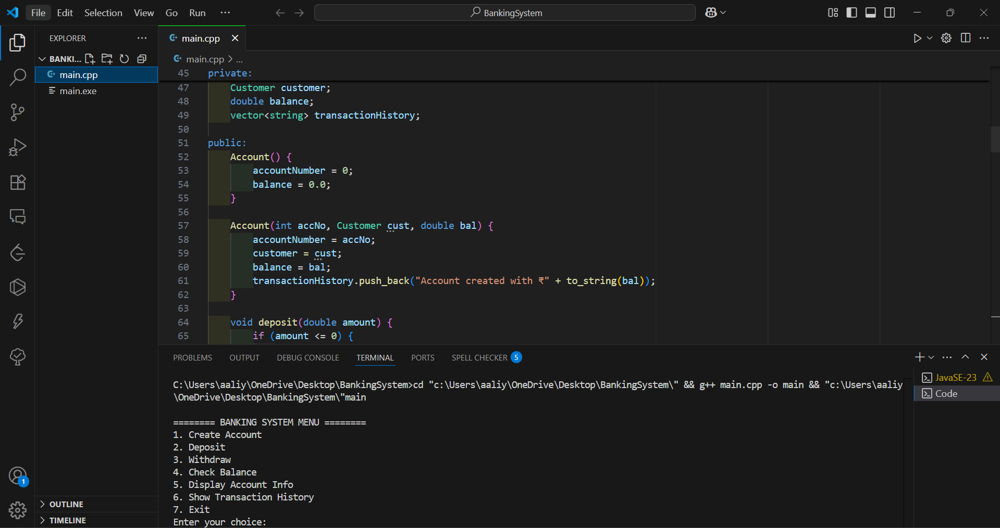

# 🏦 Banking System Simulation (C++ Internship Project Task 2)

## 📌 Task Overview
This is Task 2 of the **C++ Programming Internship**. It is a console-based simulation of a simple banking system developed using **Object-Oriented Programming** concepts in C++.

## 🎯 Objective
To simulate basic banking operations like:
- Account creation
- Deposit
- Withdrawal
- Balance check
- Transaction history (Bonus)

## 🛠️ Technologies Used
- Language: C++
- Concepts: Classes, Objects, Access Modifiers, Vectors, Constructors

## ✅ Features Implemented
- [x] Create customer and account
- [x] Deposit and withdraw money
- [x] Check account balance
- [x] View account details
- [x] Maintain transaction history
- [x] Input validation
- [x] Constructor overloading

## 📸 Sample Output

> 

## 📂 File Structure
| File | Description |
|------|-------------|
| `main.cpp` | Complete banking system code |
| `README.md` | Project summary and usage |
| `sample_output.png` | Screenshot of working program |
| `Project_Report.pdf` | (Optional) Report for submission |

## 👨‍💻 How to Run
1. Open terminal in this folder
2. Compile: `g++ main.cpp -o bank`
3. Run: `./bank` or `bank.exe`

🧑‍💻 Developed by:
Aaliya Khan – C++ Intern at Pedestal Techno World
